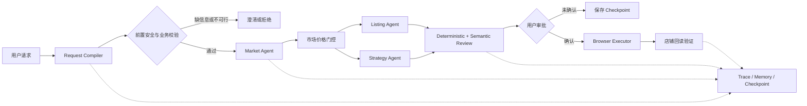

# EcomPilot MultiAgent

面向商品上新、市场调研和经营分析的对话式电商运营 Copilot。

EcomPilot 将自然语言请求编译为可审计的业务任务，由受限 Agent 完成市场样本清洗、
Listing 生成、定价促销、风险审核和店铺同步。系统通过任务级 Checkpoint、人工审批、
确定性数值工具、幂等写入与回读验证，约束 LLM 和浏览器执行的不确定性。

> 当前仓库是用于架构演示与工程评测的 v65 面试核心版。Seller Center、销售数据和
> 市场样本均为项目内模拟实现，不代表已经接入真实电商平台或具备跨主机高可用能力。

## 功能展示

- **对话式任务入口**：识别商品上新、市场调研、历史销售查询和信息补充等意图。
- **多任务会话**：同一会话中的不同任务使用独立 Checkpoint，可恢复旧任务继续处理。
- **市场价格门控**：清洗异常价格，区分核心可比、相邻档次、清仓和高端样本。
- **受控内容生成**：LLM 生成文案和单个策略提案，程序拥有价格、优惠、毛利和库存数字。
- **安全前置校验**：在昂贵节点前拦截缺失字段、互斥条件、虚假宣传和提示词注入。
- **审批后执行**：未经用户确认不写店铺；确认后执行幂等写入并回读核对字段。
- **可观测与可恢复**：记录模型、工具、权限、上下文和浏览器证据，支持节点级恢复。

### 页面

启动服务后可以访问四个相互关联的页面：

| 页面 | 地址 | 用途 |
|---|---|---|
| 用户工作台 | `http://127.0.0.1:8474/` | 发起任务、查看 Agent 操作与审批方案 |
| 运维监控 | `http://127.0.0.1:8474/ops` | 只读查看任务状态、调用统计和恢复信息 |
| Trace 证据 | `http://127.0.0.1:8474/traces` | 定位模型、工具、状态迁移和失败类型 |
| 模拟商家后台 | `http://127.0.0.1:8474/seller-center` | 查看审批后的商品写入结果 |

## 核心链路



### 模型与程序的职责边界

| LLM 负责 | 程序与工具负责 |
|---|---|
| 理解自然语言与错别字 | Schema 校验和字段所有权 |
| 生成商品文案 | 成本、售价、优惠和毛利计算 |
| 提出一个促销方案 | 库存检查与价格门控 |
| 补充可定位的语义风险 | 权限、审批、幂等和回读验证 |

Strategy 最多调用一个只读证据工具。Review 的确定性规则始终执行；语义 Review 失败时
降级为确定性审核，不会用不完整模型输出驱动店铺写入。

## 技术栈

- Python 3.10+
- FastAPI / Uvicorn
- Pydantic v2
- LangGraph + SQLite Checkpointer
- DeepSeek OpenAI-compatible API
- Playwright
- Pytest

## 仓库结构

```text
app/
  agents/          专项 Agent 与结构化 Handoff
  copilot/         LangGraph 会话和任务编排
  context/         上下文预算与压缩
  memory/          会话、任务和商家记忆
  model/           DeepSeek 适配、重试和调用记录
  orchestration/   类型化状态、节点执行与 Checkpoint
  safety/          前置安全与业务规则
  tools/           工具注册、参数合同和权限边界
  seller_center/   模拟商家后台与回读接口
data/
  products/        无线耳机与机械键盘市场样本
  reviews/         评论分析样本
  eval/            固定评测与故障恢复用例
docs/              架构、ADR、威胁模型和评测说明
scripts/           演示、评测、浏览器和真实模型脚本
tests/             单元、集成、恢复、安全与 UI 契约测试
```

## 快速开始

### 1. 安装

```bash
git clone https://github.com/ReiSakuma/EcomPilot-MultiAgent.git
cd EcomPilot-MultiAgent

python -m venv .venv
source .venv/bin/activate
python -m pip install --upgrade pip
pip install -e ".[dev]"
playwright install chromium
```

Windows PowerShell 激活虚拟环境：

```powershell
.venv\Scripts\Activate.ps1
```

### 2. 离线启动

离线模式使用确定性模型和模拟浏览器，不需要 API Key：

```bash
python -m uvicorn app.main:app --host 127.0.0.1 --port 8474
```

打开 `http://127.0.0.1:8474/`，可以依次演示：

1. 输入一个完整商品上新请求。
2. 查看市场样本清洗、建议价格、Listing、促销与风险审核结果。
3. 确认方案前检查模拟店铺没有发生写入。
4. 点击确认同步，观察幂等写入与页面回读结果。
5. 打开 `/traces` 查看本次任务的模型、工具、权限和状态迁移记录。

推荐输入：

```text
我要上架一款成本95元的入耳式无线耳机，目标售价199元，库存800件，
最低毛利率25%，主要面向游戏爱好者。已确认功能：蓝牙5.3、游戏低延迟、
长续航、快充、通话降噪。运营目标：完成首月冷启动，文案清晰、务实。
```

## 测试与评测

### 核心回归

```bash
pytest -q
```

测试覆盖请求编译、市场价格门控、数值所有权、租户隔离、上下文、Checkpoint、幂等、
网络重试、浏览器回读和 UI API 契约。

### 面试固定评测

```bash
python scripts/run_interview_eval.py
```

重点检查 40 个固定 Case、硬约束满足率以及未授权副作用数量。报告写入
`reports/raw/interview_offline.json`，该目录已被 Git 忽略。

### 故障恢复评测

```bash
python scripts/run_recovery_eval.py
python scripts/run_tool_reliability_eval.py
```

用于验证超时、瞬时网络错误、工具失败、Checkpoint 恢复和副作用保护。只读模型节点可按
错误类型有限重试；认证错误、协议错误和未知写入状态不会盲目重放。

## 接入真实 DeepSeek

复制环境变量模板，并只在本机填写密钥：

```bash
cp .env.example .env
```

至少设置：

```bash
export ECOMPILOT_LLM_PROVIDER=deepseek
export ECOMPILOT_LLM_MODEL=deepseek-v4-pro
export DEEPSEEK_API_KEY='<your-api-key>'
export ECOMPILOT_LLM_AGENTS='listing_agent,strategy_agent,review_agent'
export ECOMPILOT_REACT_AGENTS='strategy_agent'
export ECOMPILOT_LLM_FALLBACK=fail_closed
export ECOMPILOT_BROWSER_BACKEND=playwright
export ECOMPILOT_BROWSER_BASE_URL='http://127.0.0.1:8475'
```

先执行预检和真实模型 Smoke Test：

```bash
python scripts/run_llm_preflight.py
python scripts/run_real_llm_smoke.py
python scripts/run_v65_live_deepseek_selfcheck.py --rounds 2
```

通过后启动真实模型 + Playwright 联调服务：

```bash
python scripts/run_linked_service.py
```

联调页面统一使用 `http://127.0.0.1:8475/`，其他页面仍为 `/ops`、`/traces` 和
`/seller-center`。用户端显示的真实模型调用次数与运维 Trace 读取同一任务记录。

## 安全与隐私

- `.env`、数据库、Checkpoint、Trace、浏览器截图和生成报告不会提交到 Git。
- 运维页面只读，高风险写工具需要 Capability、人工审批和一次性 Ticket。
- API Key 只从环境变量读取，不写入任务状态、日志或浏览器页面。
- 对状态未知的外部写入先回读确认，不通过重复调用“猜测”执行结果。

公开仓库前仍建议运行：

```bash
git grep -nE 'sk-[A-Za-z0-9_-]{16,}|DEEPSEEK_API_KEY=.+'
```

## 设计文档

- [项目概览](docs/PROJECT_OVERVIEW.md)
- [系统架构](docs/ARCHITECTURE.md)
- [v65 精简边界](docs/V65_INTERVIEW_CORE.md)
- [DeepSeek 配置](docs/DEEPSEEK_SETUP.md)
- [威胁模型](docs/THREAT_MODEL.md)
- [评测口径](docs/EVAL_REPORT.md)
- [架构决策记录](docs/adr/)

## License

This project is licensed under the [MIT License](LICENSE).
