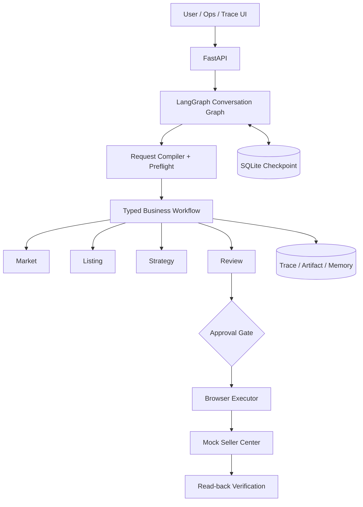

# Architecture

## 分层结构

EcomPilot 使用混合运行时：LangGraph 负责会话级路由、任务 Thread、Interrupt/Resume 和
SQLite Checkpoint；业务任务内部使用项目自己的 `TaskState`、类型化 Artifact、工具网关、
权限审批、幂等记录和 Trace。这样既利用成熟的会话恢复能力，又保留可解释的业务边界。



## 主要组件

| 组件 | 职责 |
|---|---|
| `app/copilot/graph.py` | 会话路由、任务线程、Interrupt 与 Checkpoint Resume |
| `app/orchestration/` | 业务节点、状态推进、局部恢复和失败协议 |
| `app/agents/` | Market、Listing、Strategy、Review、Browser、Analytics 职责边界 |
| `app/tools/` | 工具 Schema、Agent allowlist、超时、重试和副作用等级 |
| `app/context/` | 按优先级装配上下文并记录压缩与丢弃信息 |
| `app/memory/` | 会话、任务、商品与商家记忆 |
| `app/model/` | DeepSeek 适配、结构化输出、错误分类和调用观测 |
| `app/seller_center/` | 模拟店铺写入、执行 Ticket 和状态回读 |

## 状态与任务隔离

一个 Conversation 可以包含多个 Task。每个 Task 使用独立 `task_id`、LangGraph thread 和
业务 Checkpoint；新问题不会覆盖旧任务状态。用户再次提及历史商品时，路由层检索相关
任务和 Artifact，必要时从对应 Checkpoint 继续，而不是把整个会话压成一个共享工作流。

## 模型和确定性逻辑

Planner 与安全规则保持确定性。LLM 用于自然语言编译、Listing、Strategy 说明以及可选的
语义 Review。成本、售价、优惠、毛利率和库存由本地工具计算并覆盖模型字段。Browser
不接受自由文本动作，只执行审核后生成的 `ExecutionPlan`。

## 高风险执行链路

```text
Review 通过
  -> 独立用户审批
  -> Capability/Registry 二次校验
  -> 绑定计划的一次性 Ticket
  -> 幂等写入
  -> 页面回读
  -> 字段级比较
```

只读节点的瞬时网络故障允许有限重试。认证错误、协议错误不会重试；浏览器写入结果未知时
先回读确认，禁止直接重放，避免重复创建商品或优惠。

## 部署边界

当前 SQLite Checkpoint、进程内熔断器、本机 Playwright 和模拟 Seller Center 用于单机
演示与故障验证。代码包含租约、乐观版本和 fencing token 等并发保护语义，但仓库不宣称
已经实现跨主机事务、生产消息队列或真实电商平台一致性。
